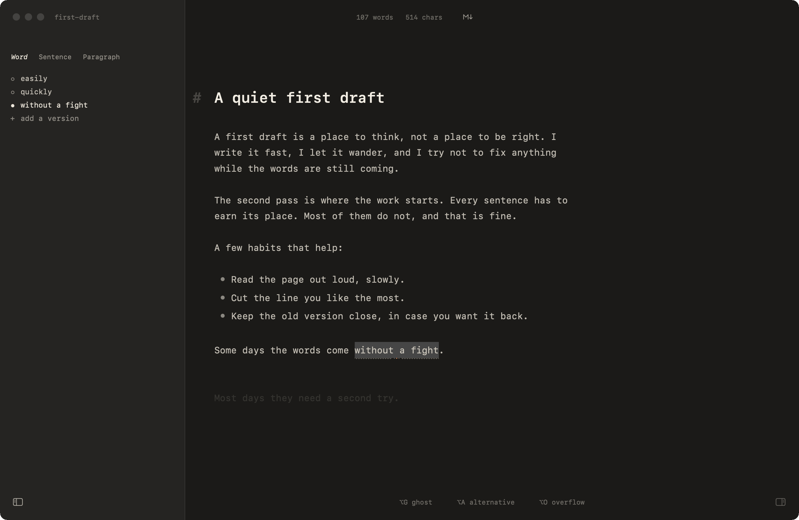
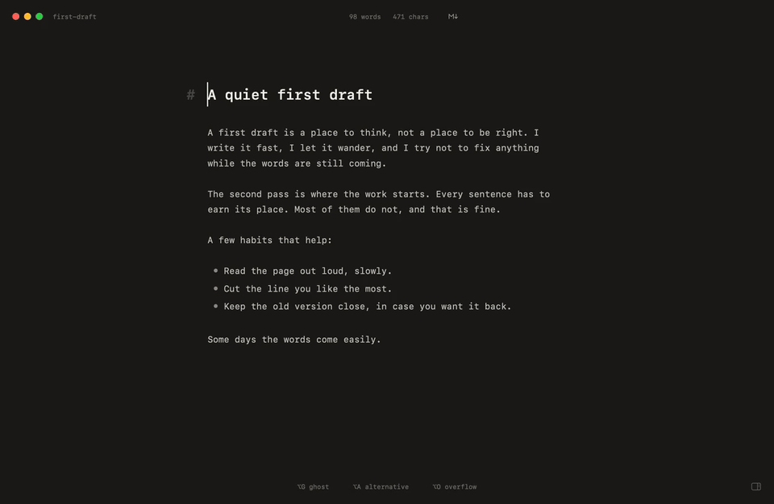

# Flowriter

A quiet, native macOS writing space for Markdown. One document per window, a
narrow column, and a few tools that help you cut and rework text without
losing any of it.

Flowriter is Swift, AppKit and TextKit 2, with no web view in the editing
path. It works offline: no account, no network calls, no AI.

<picture>
  <source media="(prefers-color-scheme: light)" srcset="docs/media/flowriter-light.png">
  
</picture>

## Features

- **Ghost**: fade a sentence instead of deleting it. It stays in the file, out
  of the word count, and comes back with one click (⌥G).
- **Alternatives**: keep other versions of a word, sentence or paragraph next
  to the text and switch between them (⌥A).
- **Overflow**: a side panel for cut text, notes and outlines that belong to
  the document but not to the page (⌥O).
- **Selection bar**: the actions for the selected text, next to the selection.
- **⌘K leader**: ⌘K, then one letter: `g` ghost, `a` alternative, `o` overflow,
  `s` stash in Overflow, `v` versions, `l` link, `r` recent files.
- **Open Recent**: File > Open Recent lists the last ten documents, newest
  first. ⇧⌘O (or ⌘K, then `r`) opens the same list as a picker you can type into.
- Live Markdown with marks always visible, so moving the caret never reflows
  the text. Tables, math, Mermaid, images and HTML blocks render in place.

Ghosts, alternatives and overflow live in a small sidecar file next to the
document (`.<name>.md.flowriter.json`). The Markdown file itself stays plain.

## Demo



The same demo as a video: [demo.mp4](docs/media/demo.mp4) (25 seconds).

## Build

Requires macOS 14+ and Swift 6 (Xcode 16 or a matching toolchain).

```sh
swift build --product FloStateNative        # debug build
swift run FloStateNative                    # run it (unbundled)
scripts/bundle.sh                           # release build -> build/Flowriter.app
INSTALL=1 scripts/bundle.sh                 # ...and install it as /Applications/Flowriter.app
```

`scripts/bundle.sh` builds with `-j ${JOBS:-2}`; set `THROTTLE` to a wrapper
command (for example `nice -n 10`) to lower its priority. The app is ad-hoc
signed unless `DEVELOPER_ID` is set (`scripts/sign.sh`). The bundle id is
`app.flowriter.Flowriter`; set `BUNDLE_ID` to build under another one.

The app does not update itself. Sparkle stays linked from upstream but is never
started, and the bundle has no feed URL.

`FLO_SPACE=0 swift run FloStateNative` runs the upstream Flo State shell
(sidebar, tabs, properties table) instead of the writing space.

## Layout

| Path | What |
|---|---|
| `Sources/FloCore` | Platform-independent core: a Swift port of `@lezer/markdown` (plus GFM), editor state, transactions and history, editing commands and keymaps, the render planner, the app model, and the writing sidecar (`Writing/`). |
| `Sources/FloKit` | AppKit/TextKit 2 editor: text view, layout, widgets, find, paste, and the writing layers (`Editor/Writing/`). |
| `Sources/FloStateNative` | The app: window, writing space, panels, menus, shortcuts, and the scripted window tests (`*SelfTest.swift`). |
| `Tests/` | Unit and parity tests (XCTest) and the fixture posts the window tests open. |
| `fixtures/`, `oracle/` | Behaviour recorded from the original web app and the harness that records it (from upstream). |
| `tools/` | Scripts that rebuild the bundled JavaScript. |
| `docs/` | `SPEC.md` (behavioural spec of the web app), `KEYS-DEVIATIONS.md`. |

## Testing

```sh
swift test
```

The unit and parity tests need no network, no browser and no files outside
the repo.

The window tests (`scripts/*-vm-test.sh`, all of them through
`scripts/all-vm-suites.sh`) open real windows and drive them with synthetic
key and mouse events. Run them in a macOS virtual machine, never on your own
desktop. `VM_RUN` below stands for any command that runs a shell command
inside the VM, in a copy of this repo.

```sh
$VM_RUN scripts/all-vm-suites.sh          # every suite, stops at the first failure
$VM_RUN 'scripts/all-vm-suites.sh --all'  # every suite, even after a failure
$VM_RUN 'scripts/ui-vm-test.sh ghost restart-ghost'
```

Logs and screenshots go to `~/flo-out` inside the VM.

The oracle harness that re-records `fixtures/` against the original web
frontend is described in the upstream repository.

## License and credits

Flowriter is free software, licensed under the **GNU General Public License
v3.0 or later** (GPL-3.0-or-later). See [LICENSE](LICENSE).

Forked from [Flo State](https://github.com/Altimor/flo-state) by Altimor,
GPLv3. Flo State is in turn a derivative work of
[writer-computer](https://github.com/joelbqz/writer-computer) by Joel
([@joelbqz](https://github.com/joelbqz)) and contributors, licensed under
GPL-3.0. Its behaviour, settings schema
(`Sources/FloCore/Resources/settings.schema.json`), themes, and parts of its
source (for example the Mermaid canvas and the HTML-block sanitizer
configuration, bundled via `tools/`) are taken from that project.

Bundled or ported third-party code:

| Component | Where | License |
|---|---|---|
| [KaTeX](https://github.com/KaTeX/KaTeX) 0.16 (JS, CSS, fonts) | `Sources/FloCore/Resources/katex/` | MIT |
| [beautiful-mermaid](https://www.npmjs.com/package/beautiful-mermaid), bundled with [elkjs](https://github.com/kieler/elkjs) and [entities](https://github.com/fb55/entities) | `Sources/FloCore/Resources/mermaid/mermaid-widget.js` | MIT; elkjs: EPL-2.0; entities: BSD-2-Clause |
| [CodeMirror 6](https://codemirror.net) (`@codemirror/language`, `language-data`, `lang-*`) and [Lezer](https://lezer.codemirror.net) parsers (`@lezer/*`) | `Sources/FloCore/Resources/codehl.js` (bundled); `Sources/FloCore/Markdown` is a Swift port of `@lezer/markdown` | MIT |
| [DOMPurify](https://github.com/cure53/DOMPurify) | `Sources/FloCore/Resources/htmlblock/sanitize.js` | MPL-2.0 or Apache-2.0 |
| [Sparkle](https://sparkle-project.org) 2 (linked, never started) | `Package.swift` | MIT |
| CommonMark/GFM spec examples from `@lezer/markdown`'s tests | `oracle/corpus-spec.json`, `fixtures/trees.json` | MIT |

The bundled JavaScript files are minified builds; their sources are the npm
packages above at the versions pinned by writer-computer's lockfile, and
`tools/*/build.sh` rebuilds them.
