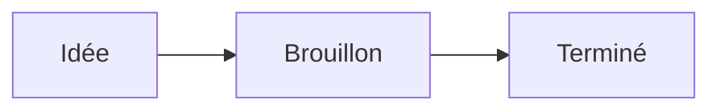

# Bienvenue dans Flowriter

Ce carnet n’est qu’un dossier de simples fichiers Markdown, rangé dans votre dossier Documents. N’importe quelle app peut les ouvrir, et rien ne vous enferme.

## Écrire

Le Markdown s’affiche au fil de la frappe. La syntaxe apparaît sur la ligne en cours d’édition et s’efface partout ailleurs : **gras**, _italique_, `code`, [liens](https://github.com/jonnilundy/flowriter).

- Les listes continuent quand vous appuyez sur Retour
- [ ] Les cases à cocher aussi
- [x] Cliquez sur une case pour la cocher

## Se déplacer

- **⌘K** lance n’importe quelle commande. **⌘O** ouvre une note par son nom.
- **⌘⇧F** recherche dans toutes vos notes.
- **⌘N** crée une note. **⌘T** ouvre un nouvel onglet.
- **⌘\\** affiche ou masque la barre latérale.
- Tapez `[[` pour créer un lien vers une autre note, comme [[Bienvenue]].

## Notes quotidiennes

**⌘⇧D** ouvre l’entrée du jour dans votre note quotidienne, et ajoute un titre daté s’il n’existe pas encore.

## Replier les titres

Survolez un titre et cliquez sur la flèche à sa gauche pour replier tout ce qu’il contient. **⌘⌥←** replie tous les titres et **⌘⌥→** les déplie.

## Images, tableaux, maths et diagrammes

Collez ou déposez une image : elle est enregistrée dans un dossier `attachments` à côté de la note. Survolez-la et faites glisser la poignée d’angle pour la redimensionner, ou faites un clic droit pour choisir une taille prédéfinie.

| Fonction | Raccourci |
| --- | --- |
| Palette de commandes | ⌘K |
| Rechercher dans les notes | ⌘⇧F |

Les maths utilisent LaTeX : $e^{i\pi} + 1 = 0$

## Personnalisez-le

**⌘,** ouvre les Réglages : thèmes, polices, tailles et espacements. **⌘+** et **⌘−** changent la taille du texte.

Supprimez cette note quand vous voulez. Bonne écriture !
