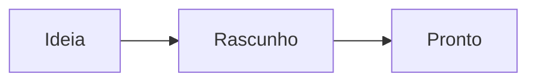

# Boas-vindas ao Flowriter

Este caderno é apenas uma pasta de arquivos markdown simples na sua pasta Documentos. Qualquer app pode abri-los, e nada fica preso.

## Escrever

O Markdown é formatado enquanto você digita. A sintaxe aparece na linha que você está editando e sai do caminho em todo o resto: **negrito**, _itálico_, `código`, [links](https://github.com/jonnilundy/flowriter).

- As listas continuam quando você pressiona Return
- [ ] Caixas de seleção também
- [x] Clique em uma para marcá-la

## Navegar

- **⌘K** executa qualquer comando. **⌘O** abre uma nota pelo nome.
- **⌘⇧F** busca dentro de todas as suas notas.
- **⌘N** cria uma nota. **⌘T** abre uma nova aba.
- **⌘\\** mostra ou oculta a barra lateral.
- Digite `[[` para criar um link para outra nota, como [[Boas-vindas]].

## Notas diárias

**⌘⇧D** vai para a entrada de hoje na sua nota diária, adicionando um título com a data se ainda não existir.

## Títulos recolhíveis

Passe o cursor sobre um título e clique na seta à esquerda para recolher tudo o que está abaixo dele. **⌘⌥←** recolhe todos os títulos e **⌘⌥→** expande todos.

## Imagens, tabelas, fórmulas e diagramas

Cole ou arraste uma imagem: ela é salva numa pasta `attachments` ao lado da nota. Passe o cursor sobre ela e arraste o canto para redimensionar, ou clique com o botão direito para tamanhos predefinidos.

| Recurso | Atalho |
| --- | --- |
| Paleta de comandos | ⌘K |
| Buscar em todas as notas | ⌘⇧F |

As fórmulas usam LaTeX: $e^{i\pi} + 1 = 0$

## Do seu jeito

**⌘,** abre os Ajustes: temas, fontes, tamanhos e espaçamento. **⌘+** e **⌘−** alteram o tamanho do texto.

Apague esta nota quando quiser. Boa escrita.