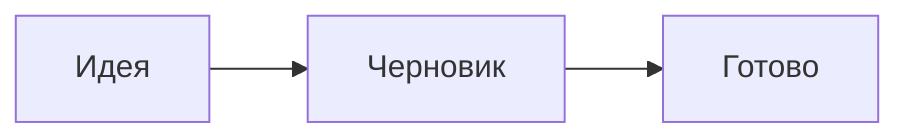

# Добро пожаловать в Flowriter

Этот блокнот — просто папка с обычными файлами Markdown в вашей папке «Документы». Их может открыть любое приложение, и ничто не заперто внутри.

## Набор текста

Markdown отображается по мере ввода. Синтаксис виден в строке, которую вы редактируете, и не мешает во всех остальных: **жирный**, _курсив_, `код`, [ссылки](https://github.com/jonnilundy/flowriter).

- Списки продолжаются при нажатии Return
- [ ] Флажки тоже
- [x] Нажмите на флажок, чтобы отметить его

## Навигация

- **⌘K** выполняет любую команду. **⌘O** открывает заметку по имени.
- **⌘⇧F** ищет по всем вашим заметкам.
- **⌘N** создает заметку. **⌘T** открывает новую вкладку.
- **⌘\\** показывает или скрывает боковое меню.
- Введите `[[`, чтобы сослаться на другую заметку, например [[Приветствие]].

## Ежедневные заметки

**⌘⇧D** переходит к сегодняшней записи в ежедневной заметке и добавляет заголовок с датой, если его еще нет.

## Сворачивание заголовков

Наведите указатель на заголовок и нажмите стрелку слева от него, чтобы свернуть все, что под ним. **⌘⌥←** сворачивает все заголовки, а **⌘⌥→** разворачивает их.

## Изображения, таблицы, формулы и диаграммы

Вставьте или перетащите изображение: оно сохранится в папке `attachments` рядом с заметкой. Наведите на него указатель и потяните за угол, чтобы изменить размер, или нажмите правой кнопкой, чтобы выбрать готовый размер.

| Функция | Сочетание клавиш |
| --- | --- |
| Палитра команд | ⌘K |
| Поиск по всем заметкам | ⌘⇧F |

Формулы пишутся на LaTeX: $e^{i\pi} + 1 = 0$

## Настройте под себя

**⌘,** открывает настройки: темы, шрифты, размеры и интервалы. **⌘+** и **⌘−** меняют размер текста.

Удалите эту заметку, когда захотите. Приятной работы.